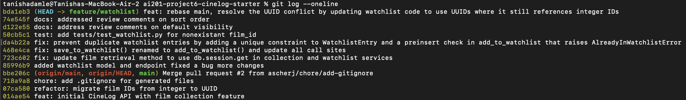

# PR Response Doc — CineLog Watchlist Feature

## AI Usage
I used Claude mainly to understand the codebase before making changes — asking specific questions about individual files (like `models.py`, `collection_service.py`, and `test_collection.py`) to learn the naming conventions, how deduplication was handled, and how things fit together. For the review comments, I used Claude to help locate the bug or issue each comment pointed to, then I went and made the fix myself; afterwards I asked Claude to double-check my work and confirm I hadn't missed anything. For the test file, Claude helped me understand the existing test structure so I could write a new test in the same format. The opinion-based comments (default visibility and sort order) were my own decisions — I didn't really rely on Claude for those positions. Claude also helped me put together the PR description.

## Comment 1 — Rename
save_to_watchlist() should follow the project's naming convention. Compare with add_to_collection() — the pattern here is verb_to_noun. Please rename to add_to_watchlist() and update all call sites.
**What I did:** Renamed `save_to_watchlist()` to `add_to_watchlist()` in `services/watchlist_service.py` to match the project's `verb_to_noun` convention (consistent with `add_to_collection()`). Updated the only call site — the import and invocation in `routes/watchlist/watchlist.py`. A repo-wide grep confirms no other references existed.
**How I verified:** `grep -rn "save_to_watchlist"` returns nothing; both edited files compile (`python -m py_compile`) and import cleanly; the existing `tests/` suite still passes.

## Comment 2 — Deduplication
What happens if a user calls this with a film that's already on their watchlist? The current implementation would add a duplicate entry. Please handle this case.
**What I did:** Mirrored the two-layer dedup approach already used for collections. (1) Added a `UniqueConstraint("user_id", "film_id")` to the `WatchlistEntry` model — it previously lacked the constraint `CollectionEntry` has, so duplicates were possible at the DB level. (2) Added an `AlreadyInWatchlistError` exception and a pre-insert check in `add_to_watchlist()` so a duplicate raises a clean domain error instead of a DB IntegrityError. (3) Updated the `POST /watchlist/<user_id>/add` route to catch it and return HTTP 409, matching the collection route's behavior.
**How I verified:** Adding the same film twice now raises `AlreadyInWatchlistError` and only one row persists; the endpoint returns 409 on the second add. Confirmed the models/service/route compile and the existing suite still passes.

## Comment 3 — Missing test
Please add a test for the case where film_id doesn't exist in the database. Look at the existing tests in test_collection.py — the pattern is there. Create a new file tests/test_watchlist.py. Read tests/test_collection.py and find test_add_to_collection_nonexistent_film_raises — write the equivalent test for add_to_watchlist() following the same fixture and assertion structure.
**What I did:** Created `tests/test_watchlist.py` with the same `app`, `sample_user`, and `sample_film` fixtures as `test_collection.py`. Added `test_add_to_watchlist_nonexistent_film_raises`, the direct equivalent of `test_add_to_collection_nonexistent_film_raises`: it calls `add_to_watchlist()` with a film_id that was never inserted and asserts `FilmNotFoundError` is raised inside `pytest.raises(...)`. (Since film IDs are still integers on this branch, the fake id is `999999` rather than a UUID string — this becomes a UUID in Comment 6.)
**How I verified:** `pytest tests/test_watchlist.py` passes, and the full `tests/` suite stays green.

## Comment 4 — Default visibility
I notice watchlists default to public=True. We don't have a documented decision on default visibility for user lists. Before I can approve this, I need you to add a note to your PR description explaining your reasoning. I want to make sure we're being intentional here, not just inheriting a default.
**My position:** New watchlist entries should default to `public=True`. This is a deliberate choice, not an inherited default.
**Reasoning:** The watchlist is a discovery/social feature — its value comes from being shareable (seeing what friends plan to watch, recommending films). Defaulting to public keeps the primary use case friction-free: a user who wants to share their list doesn't have to flip a setting first. This mirrors how comparable "want to watch" lists work on platforms like Letterboxd, where lists are shareable by default. The `public` field is per-entry and writable, so a user who wants privacy can already set it to `False`; the default only decides the starting point, not the ceiling on control.
**Tradeoff acknowledged:** The real cost is privacy-by-default: a user's watchlist is visible before they make any explicit sharing choice, which can surprise people who assume personal lists start private. I judged that acceptable because a watchlist is low-sensitivity data (films someone intends to watch, not viewing history or ratings) and the feature is fundamentally about sharing. If we later add higher-sensitivity lists, or if user research shows people expect privacy-first, the honest move is to flip the default to `public=False` (opt-in sharing) rather than rely on users discovering the toggle. Flagging this so the default is a recorded decision we can revisit, not an accident.

## Comment 5 — Sort order
I'd prefer watchlists to default to "date added" order rather than alphabetical. Most users want to see what they added recently. I'm open to discussion if you see it differently — but let's make a decision and document it.
**My position:** Keep the default sort alphabetical by title (the current `get_watchlist` behavior).
**Reasoning:** A watchlist is something users return to in order to *find a specific film to watch* — "what do I want to put on tonight?" Alphabetical order makes a title predictable to locate: you scan to roughly where it should be and it's there. Date-added order optimizes for a different task (seeing what you just added), but for finding a known title it means scrolling the whole list, since position depends on when it was added rather than anything the user can predict. As a watchlist grows, alphabetical keeps lookup roughly constant while date-added gets progressively harder to scan.
**Engagement with reviewer's point:** The reviewer's point is fair — recent-first is genuinely better for the "what did I just add" moment, and that's a real use case. Where we differ is which task the *default* should optimize for: I'm weighting find-a-title (repeated, happens every time you pick something to watch) over review-recent-additions (occasional, right after adding). Since the field and query are easy to change, this isn't a one-way door — a good follow-up would be to let the client pass a sort parameter (`?sort=recent`) so both are supported and the default stops being a forced choice. Happy to switch the default to date-added if we'd rather align with the collection view, but documenting alphabetical as the intentional decision here.

## Comment 6 — Rebase
A refactor merged to main that changed film IDs from integers to UUIDs. Your watchlist code still references integer IDs. Please rebase on main and update accordingly.
**What conflicted:** Rebasing `feature/watchlist` onto `main` produced two conflicts. (1) `.gitignore` — an add/add conflict, since both branches independently created one. (2) `models.py` — main had migrated `Film.id` and `CollectionEntry.film_id` to `String(36)` UUIDs, while my branch added the `WatchlistEntry` model with an integer `film_id` foreign key pointing at `film.id`.
**How I resolved it:** For `.gitignore`, merged both sets of ignore rules into one file. For `models.py`, kept main's UUID definitions of `Film` and `CollectionEntry` and changed `WatchlistEntry.film_id` from `db.Integer` to `db.String(36)` so the foreign key matches the now-UUID `Film.id`. I also updated the remaining integer assumptions the merge didn't touch: the `film_id` docstrings in `add_to_watchlist()` and the add route (int → UUID), and the test's nonexistent id (`999999` → a UUID string), matching how `test_collection.py` does it.
**How I verified no conflict remains:** `git log --oneline --merges origin/main..HEAD` is empty (linear history, no merge commits) and `git merge-base --is-ancestor origin/main HEAD` confirms the branch sits on top of main. No conflict markers remain, all modules compile, and the test suite passes.

## PR Description

### What the watchlist feature does
It lets a user save films they want to watch later — separate from their collection (films they've already watched). Users can add a film to their watchlist and view their whole watchlist. A film can't be added twice, and you can't add a film that doesn't exist.

Endpoints (under `/watchlist`):
- `GET /watchlist/<user_id>` — view a user's watchlist.
- `POST /watchlist/<user_id>/add` — add a film. Body: `{ "film_id": "<uuid>" }`.

### Design decisions
1. **Default visibility: public.** New watchlist entries are public by default, because the watchlist is meant to be shared. Users can still make an entry private.
2. **Sort order: alphabetical by title.** The watchlist is shown in A–Z order, since users mostly open it to find a specific film to watch.

### How to test it manually
1. Start the app:
   ```bash
   python app.py     # runs on http://localhost:5000
   ```
2. Create a user and a few films to test with (there's no endpoint for this yet), and copy the printed IDs:
   ```bash
   python -c "
   from app import create_app, db
   from models import User, Film
   app = create_app()
   with app.app_context():
       u = User(username='alice', email='alice@example.com')
       films = [Film(title='Dune'), Film(title='Arrival'), Film(title='Blade Runner')]
       db.session.add_all([u, *films]); db.session.commit()
       print('USER_ID =', u.id)
       for f in films: print(f.title, '=', f.id)
   "
   ```
3. Add a film (should return `201`):
   ```bash
   curl -X POST http://localhost:5000/watchlist/<USER_ID>/add \
     -H "Content-Type: application/json" -d '{"film_id": "<DUNE_ID>"}'
   ```
4. Add the other two films, then view the watchlist:
   ```bash
   curl http://localhost:5000/watchlist/<USER_ID>
   ```
   - Films come back in A–Z order: Arrival, Blade Runner, Dune.
   - Each entry shows `"public": true`.
5. Check the error cases:
   - Add the same film again → `409` (already on watchlist).
   - Add a made-up film id → `404` (film not found).
   - Send an empty body `{}` → `400` (film_id is required).

## Commit History
The `git log --oneline` output below shows the clean, linear commit history after rebasing on main (one commit per review comment, no merge commits):

